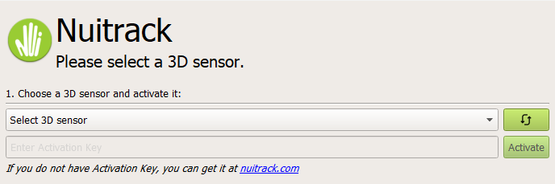

# 🏅 Olympic AR Games

**Olympic AR Games** es un videojuego en **realidad aumentada** que utiliza el software [Nuitrack](https://nuitrack.com/) para la detección del cuerpo del jugador.

---

## 📌 Requisitos para jugar

- ✅ [Licencia Nuitrack](https://nuitrack.com/)
- ✅ Cámara de profundidad compatible con Nuitrack  
  👉 [Lista de cámaras soportadas](https://nuitrack.notion.site/87e45f2fb76c4456973f826dc1583ebc?v=c5bce550492145f4b4c7335f24f819fd)

---

## 🔑 Licencia

La licencia de **Nuitrack** puede conseguirse desde su [página oficial](https://nuitrack.com/).  

- El plan gratuito tiene un límite de **3 minutos de uso**, por lo que se recomienda cualquier otra versión de pago.  
- La licencia se liga al **hardware de la cámara** → una licencia solo puede activar **una cámara**.  

---

## ⚙️ Instalación

1. Instalar **[Nuitrack Runtime](https://github.com/3DiVi/nuitrack-sdk/releases)** para tu sistema operativo.  
2. Conectar la cámara de profundidad e introducir la licencia.  
     
3. Descargar la carpeta **Build** o clonar este repositorio.  
4. Ejecutar el archivo **`TFG.exe`** para iniciar el juego.  

---

## 🛠️ Tecnologías

Este videojuego ha sido desarrollado con:  

- 🎮 [Unity](https://unity.com/)  
- 📷 Cámara **Intel RealSense D435**  
- 🧍 [Nuitrack SDK](https://nuitrack.com/) para seguimiento corporal  

---

## 🎮 Juego

Este videojuego simula la participación en unos **Juegos Olímpicos**.  
Se incluyen **4 disciplinas deportivas**, cada una jugada en **dos rondas** (semifinal y final) con una duración de **30 segundos** por ronda:

- 🏃 Atletismo  
- 🥊 Boxeo  
- 🏀 Baloncesto  
- 🚣 Piragua  

### Mecánicas generales

- Al iniciar el juego, el sistema solicita un **nombre de usuario** (mínimo 3 letras).  
  Este se utiliza como **identificador** para almacenar las puntuaciones de forma **persistente** en el dispositivo.  
- Antes de cada disciplina, se muestra una **pantalla de instrucciones** con explicación textual y visual.  
- El juego no comienza hasta que se **detecta y valida la presencia del jugador**.  
- Tras cada disciplina, se muestra un **ranking con las 5 mejores puntuaciones** obtenidas en esa prueba.  

---

## 🏅 Funcionamiento de las disciplinas

### 🏃 Atletismo
- El jugador debe **correr en el sitio** para avanzar.  
- Aparecen **vallas** que se deben **saltar**; chocar con ellas supone una **penalización**.  
- La posición de las vallas se ajusta a la estatura del jugador.  

### 🥊 Boxeo
- El jugador debe **golpear al oponente** y **esquivar agachándose**.  
- ✅ Cada puñetazo conectado suma **+1 punto**.  
- ❌ Cada golpe recibido resta **-1 punto**.  
- El rival se adapta a la posición inicial del usuario.  

### 🏀 Baloncesto
- El jugador debe **agacharse** para recoger un balón.  
- Para lanzar, debe **extender los brazos por encima de la cabeza**.  
- Cada canasta encestada otorga **+3 puntos**.  
- Los balones aparecen de forma constante en el centro de la pantalla, pero solo se puede tener **uno a la vez**.  

### 🚣 Piragua
- El jugador debe realizar **giros rusos** para simular el avance en el agua.
Esta disciplina se juega sentado.
- Se coloca una **piragua virtual** en la cadera del jugador y un **remo** entre sus manos.  
- Boyas y una superficie de agua virtual refuerzan la **inmersión y ambientación**.  

---

## 📜 Licencia del proyecto

Este proyecto forma parte del **Trabajo de Fin de Grado (TFG)** y está publicado con fines académicos. Forma parte del proyecto “Efectos de los descansos activos en el rendimiento académico en niños/as con y sin TDAH” (ref: PID2021-123357OA-100), Financiado a través de la convocatoria de las Pruebas de Generación de Conocimiento (MCIN/AEI/10.13039/501100011033/FEDER, UE) 

El uso de **Nuitrack** requiere una licencia válida adquirida en su página oficial.  

---
